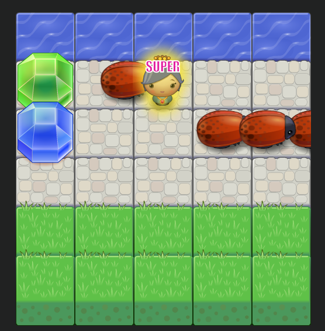

# Arcade Game by Nekki
######  Front End Web Developer Nanodegree project
## About
This is a game you can enjoy just by controlling with 4 keys(up, down, left, right).
Your mission is very simple:
+ avoid enemies
+ get items
+ reach to the top
You must do the things above within 10 seconds in each level.

## Getting Started
To run the app, simply visit the site blow with your browser.  
https://nekki-t.github.io/FEND-ArcadeGameClone/  
If you want to run the app locally, follow the instructions below.  
##### 1. Open your terminal and clone this repository to a directory you like:
```
$ git clone https://github.com/nekki-t/FEND-ArcadeGameClone.git
```
##### 2. Move to the directory which you cloned to:
```
e.g.
$ cd /directory/FEND-ArcadeGameClone
```
##### 3. Install http-server:
```
$ npm install http-server -g
```
ref. https://github.com/indexzero/http-server
##### 4. Run server:
```
$ http-server
```
##### 5. Visit url:
```
$ http://localhost:8080
```
You can also visit one of the urls shown on your terminal.  
## How to play

### 1. Opening animation
As soon as click the link for the app in your browser, opening animation will come up.
Just enjoy it and get ready for starting the game. 


### 2. Start view
After the opening animation, you will see start view. To start the game, click either "Start" or "Start with sounds" button.
Clicking "Start", you can play the game quietly.
On the other hand, you can enjoy it with BGM and sounds.
Once you click one of the buttons, the game will start in seconds.


### 3. Game start
As you can see on the image below, now you start the game. As mentioned above, all key you use are only up, down, left and right buttons to control your game character.  


#### The view composed of 3 sections.
+ Game status Information section
+ Game section
+ Time limit section

#### Game Status Information Section
Here you can check your current level on the top, score on the middle and lives you have on the bottom.  


#### Game Section
This is the main section where you play the game. Your game character, a boy at the beginning, is shown on the bottom.
Controlling the boy, you just go up to the top area, shown as something like water blocks. Rules in details are written in the bottom of this README.  


#### Time limit Section
This area shows how much time is remaining for your finishing a level. You have only 10 seconds for each level.  


## Rules
### Lives
You have 3 lives at the beginning shown as heart image. When your character is collided with an enemy, you lose one life.
It is game over if there is no life, in another word, heart left at all.

### Level finish
If your character reached to either one of the top water blocks, it means that you finished the level.  
Points will be added to your score for the level and the game will go on for a next level with more difficulty. Depends on your level, your character will change.

### Scoring for finishing a level
When you finish a level, points are added to your score. The adding points are 500 multiplied by the finished level number.

### Time out
You have to finish each level with in 10 seconds. If you fail to do it, you lose one life.

### Items
You will see 3 kinds of items on the game area.
+ Gems with 3 different colors  
+ Heart
+ Star  

#####
These gems are shown randomly on each level. Besides, 3 gems can be shown at most simultaneously whereas heart and star can be shown only 1 respectively. 
If you don't get items in a certain level, items won't be taken over to the next level. These will be reset for the next level.

##### Gems
If your character moved on to a gem, you can get it and points of it will be added to your score.
There are three colors for gems, blue, green and gold.
+ Blue Gem -> 1000 points
+ Green Gem -> 5000 points
+ Gold Gem -> 10000 points

##### Heart
You can increase the count of your lives by getting hearts on the screen. If you get a heart, your life is increased by one.

##### Star
Getting a star enables your character to be invincible for 3 levels afterwards. However, stars will begin to appear only after your character becomes above certain level.  
  
In addition, even while your character is invincible, it cannot avoid time out death. Be careful!  


### Character
You will see 5 different characters as you pass over levels.
+ less than level 5  
simple body
+ level 5 to level 9  
pink girl
+ level 10 to level 19  
cat girl
+ level 20 to level 29  
horn girl
+ level 30 and above  
princess

### To get higher score
Try to get as many as gems, heart and stars. Especially, it is very wise to get stars first then collect other items after the game become so difficult.  
Have fun and Cheers!!